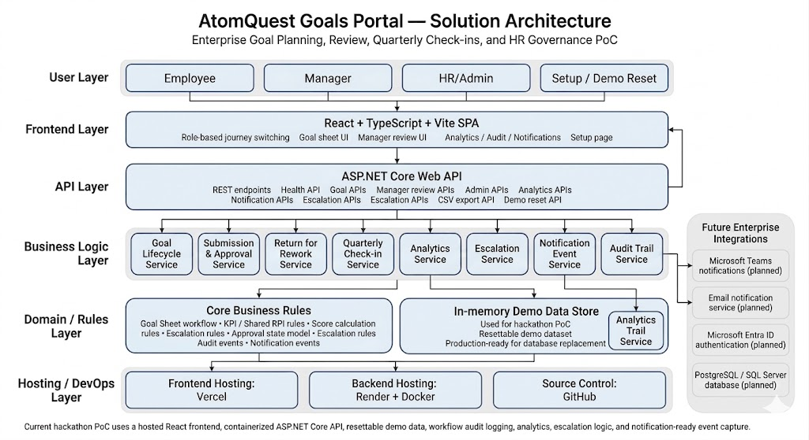
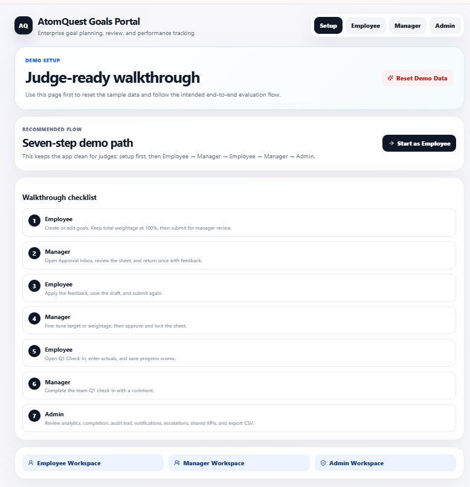
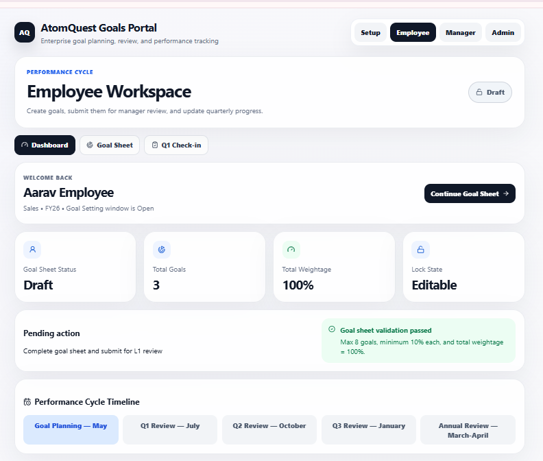
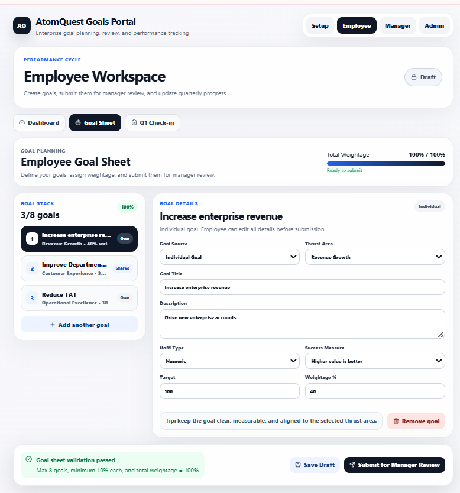
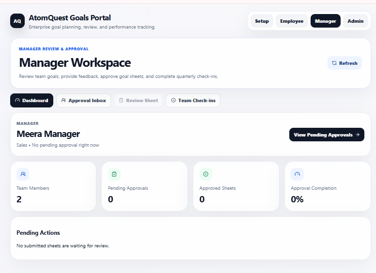
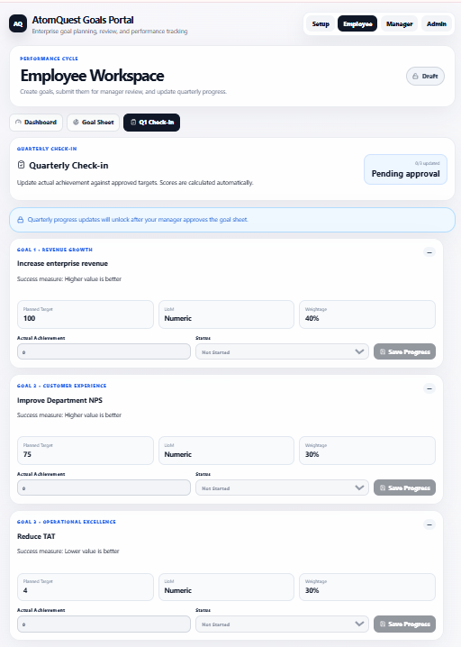
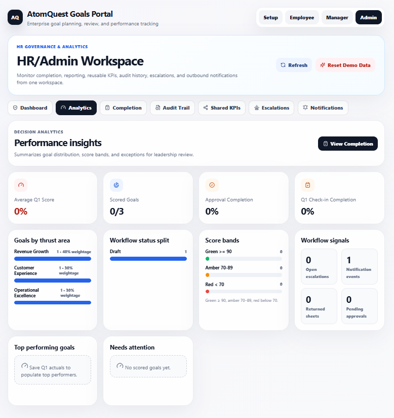
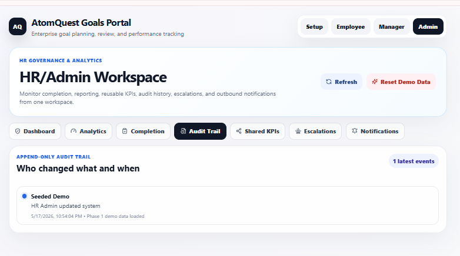
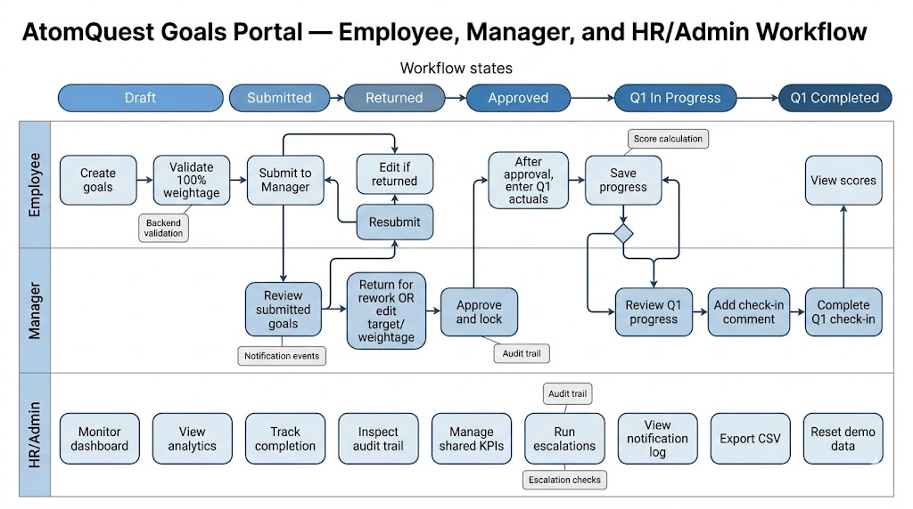

# AtomQuest Goals Portal

AtomQuest Goals Portal is a hosted enterprise goal planning, manager review, quarterly check-in, and HR governance proof of concept.

It demonstrates a complete performance goal lifecycle across three key business personas:

- Employee
- Manager
- HR/Admin

The portal supports goal creation, manager review, return-for-rework, approval locking, quarterly achievement capture, backend-driven score calculation, manager check-ins, HR analytics, audit history, shared KPI templates, escalation monitoring, notification tracking, CSV export, and demo reset.

---

## Live Demo

### Frontend Portal

https://atomquest-goals-portal-pyqq.vercel.app/

### Backend API Health Check

https://atomquest-goals-portal.onrender.com/health

### Source Code Repository

https://github.com/Sejal-Dubey/atomquest-goals-portal

---

## Role Access

No login credentials are required for this POC.

Judges can switch between user journeys directly from the top navigation:

- Setup
- Employee
- Manager
- Admin

This keeps evaluation fast and avoids authentication friction during judging.

---

## Architecture Diagram



## Steps to follow

Start from the **Setup** page.

Click:

**Reset Demo Data**

This restores the default sample workspace and allows the full workflow to be tested from the beginning.

---

### 1. Setup / Demo Reset



### 2. Employee Goal Sheet




### 3. Manager Review Sheet



### 4. Employee Q1 Check-in



### 5. HR/Admin Analytics



### 6. Audit Trail and Notifications



---


## Persona Flow Diagram



## Demo Flow

The complete demo flow is designed to show the end-to-end goal lifecycle.

### 1. Reset Demo Data

Go to:

**Setup**

Click:

**Reset Demo Data**

Expected result:

- Demo data is restored
- Goal workflow starts from a clean baseline
- Judges can safely repeat the evaluation flow

---

### 2. Employee Creates and Submits Goals

Go to:

**Employee → Goal Sheet**

The employee can:

- Review existing goals
- Add or edit individual goals
- Select shared KPI templates
- Maintain total weightage at 100%
- Save draft
- Submit goals to the L1 Manager

Expected result:

- Goal sheet status becomes **Submitted**
- Employee editing is locked
- Manager receives the sheet in the approval flow

---

### 3. Manager Reviews Submitted Goals

Go to:

**Manager → Approval Inbox**

Open the employee goal sheet.

The manager can:

- Review submitted goals
- Adjust targets and weightage inline
- Return the sheet for rework with comments
- Approve and lock the sheet

---

### 4. Return-for-Rework Flow

Go to:

**Manager → Review Sheet**

Click:

**Return for Rework**

Expected result:

- Goal sheet status becomes **Returned**
- Employee editing is unlocked
- Manager feedback is visible to the employee
- Employee can revise and resubmit the sheet

---

### 5. Employee Resubmits Goals

Go to:

**Employee → Goal Sheet**

Make a small change and click:

**Submit to L1 Manager**

Expected result:

- Goal sheet status becomes **Submitted** again
- Employee editing is locked again
- Manager can review the updated sheet

---

### 6. Manager Approves and Locks

Go to:

**Manager → Review Sheet**

Click:

**Approve & Lock**

Expected result:

- Goal sheet status becomes **Approved**
- Employee goal editing is locked
- Quarterly achievement capture becomes available

---

### 7. Employee Captures Quarterly Progress

Go to:

**Employee → Q1 Check-in**

Enter actual achievement values and save progress.

The backend calculates scores automatically using the goal success measure.

Example formulas:

```text
Higher value is better:
Score = Actual / Target × 100

Lower value is better:
Score = Target / Actual × 100
````

Score health bands:

* Green: `>= 90`
* Amber: `70–89`
* Red: `< 70`

Expected result:

* Q1 actuals are saved
* Scores are calculated by the backend
* HR/Admin analytics update
* Audit and notification events are created

---

### 8. Manager Completes Team Check-in

Go to:

**Manager → Team Check-ins**

The manager can:

* Review planned vs actual performance
* View calculated scores
* Add a structured manager comment
* Complete the quarterly check-in

Expected result:

* Q1 check-in is marked complete
* HR/Admin dashboards update
* Audit trail captures the action
* Notification log captures the action

---

### 9. HR/Admin Governance Review

Go to:

**Admin**

The HR/Admin workspace includes:

* Dashboard
* Analytics
* Completion tracking
* Audit Trail
* Shared KPIs
* Escalations
* Notifications
* CSV export

HR/Admin can review the entire goal cycle from a governance and reporting perspective.

---

## Key Features

### Employee Workspace

The employee workspace supports:

* Goal planning
* Draft saving
* Goal submission
* Shared KPI selection
* Return-for-rework correction
* Quarterly actual achievement entry
* Backend-calculated progress score display

---

### Manager Workspace

The manager workspace supports:

* Approval inbox
* Goal review
* Inline target and weightage edits
* Return for rework with comment
* Approve and lock workflow
* Team quarterly check-in review
* Manager check-in completion

---

### HR/Admin Workspace

The HR/Admin workspace supports:

* Governance overview
* Performance analytics
* Completion dashboard
* Audit trail
* Shared KPI template management
* Escalation monitoring
* Notification event tracking
* Achievement CSV export
* Demo data reset

---

## Technology Stack

### Frontend

* React
* TypeScript
* Vite
* CSS
* Vercel Hosting

The frontend is responsible for:

* Role-based journey switching
* Employee, Manager, Admin, and Setup views
* Form interactions
* REST API calls
* Workflow status display
* Analytics, audit, notifications, and score summaries

---

### Backend

* ASP.NET Core Web API
* C#
* Docker
* Render Hosting

The backend is responsible for:

* Goal lifecycle APIs
* Submission and approval state changes
* Return-for-rework workflow
* Q1 score calculation
* Manager check-in completion
* Audit event creation
* Notification event creation
* Escalation check logic
* Demo reset endpoint
* CSV export endpoint

---

### Hosting

* **Vercel** is used for the React/Vite frontend because it provides fast static hosting and simple GitHub-based deployment.
* **Render** is used for the ASP.NET Core backend because it supports Docker-based API deployment.
* **GitHub** is used for source control and deployment integration.

---

## Architecture Overview

AtomQuest Goals Portal uses a separated frontend and backend architecture.

```text
+-----------------------------+
|         User Browser         |
|  Setup / Employee / Manager |
|          HR/Admin            |
+--------------+--------------+
               |
               | HTTPS
               v
+-----------------------------+
|        Frontend App          |
|   React + TypeScript + Vite |
|        Hosted on Vercel      |
+--------------+--------------+
               |
               | REST API Calls
               v
+-----------------------------+
|        Backend API           |
|    ASP.NET Core Web API      |
|     Docker + Render Hosting |
+--------------+--------------+
               |
               | In-memory demo data
               v
+-----------------------------+
|       Demo Data Layer        |
| Employees, Goals, Reviews,  |
| Q1 Updates, Audit Events,   |
| Notifications, Escalations  |
+-----------------------------+
```

---

## Important API Capabilities

The backend exposes REST APIs for:

* Health check
* Demo reset
* Goal sheet retrieval
* Goal creation and update
* Goal submission
* Manager return for rework
* Manager approval and locking
* Quarterly actual updates
* Manager check-in completion
* Admin analytics
* Completion dashboard
* Audit trail
* Shared KPI templates
* Escalation checks
* Notification log
* CSV export

---

## Workflow State Model

The goal sheet moves through the following states:

```text
Draft → Submitted → Returned → Submitted → Approved → Q1 In Progress → Q1 Completed
```

### Draft

* Employee can create and edit goals.
* Employee can save draft.
* Employee can submit the sheet to the manager.

### Submitted

* Employee editing is locked.
* Manager can review the submitted sheet.
* Manager can approve the sheet or return it for rework.

### Returned

* Employee editing is unlocked.
* Manager feedback is visible to the employee.
* Employee can update the goals and resubmit.

### Approved

* Goal sheet is locked.
* Q1 achievement capture becomes available.
* Employee can enter actual achievement values.

### Q1 Completed

* Manager has completed the quarterly review.
* HR/Admin can view final progress, audit records, notifications, and governance data.

---

## Notification Design

The application includes a notification-ready architecture.

Instead of sending real external emails or Microsoft Teams messages during judging, the system records outbound communication events in the Admin notification center.

This demonstrates where enterprise integrations would connect while keeping the deployed demo stable and reliable.

### Notification Examples

* Goal sheet submitted
* Goal sheet returned for rework
* Goal sheet approved and locked
* Q1 achievement updated
* Manager check-in completed
* Escalation generated

### Planned Production Integrations

* Microsoft Teams webhook
* Email notification service
* Microsoft Entra ID identity integration
* Role-based access control
* Persistent database storage

---

## Escalation Design

The escalation module identifies delayed or incomplete workflow actions.

Current escalation checks include:

* Employee has not submitted goals
* Manager has not approved submitted goals
* Q1 check-in is pending after approval

Escalations appear in the HR/Admin escalation monitor and are also captured as notification-ready events.

---

## Audit Trail

The audit trail records important workflow events in an append-only style.

Audit trail examples:

* Goal sheet submitted
* Manager inline edit
* Returned for rework
* Approved and locked
* Quarterly update saved
* Manager check-in completed
* Demo data reset

This supports governance, traceability, and appraisal readiness.

---

## CSV Export

HR/Admin can export achievement data as CSV.

The export includes goal and progress information that can be used for:

* HR reporting
* Appraisal preparation
* Compliance review
* Offline analysis
* Leadership summaries

---

## Demo Reset

The Setup page provides:

```text
Reset Demo Data
```

This allows the portal to be restored instantly without restarting the backend or redeploying the application.

Backend endpoint:

```http
POST /demo/reset
```

---

## Why This Architecture Works

This architecture was designed to prioritize:

* Fast evaluation
* Stable hosted demo
* Clear role-based workflows
* Traceable business process
* Backend-driven scoring logic
* Governance visibility
* Deployment simplicity
* Enterprise extensibility

The proof of concept intentionally avoids risky half-integrations such as real authentication or live Teams messaging during judging.

Instead, it shows an integration-ready architecture through:

* Notification events
* Role-based journeys
* Audit logs
* Hosted APIs
* Admin governance dashboards
* Escalation monitoring

---

## Production Roadmap

If extended beyond the hackathon, the next steps would be:

* Microsoft Entra ID authentication
* Role-based authorization
* Persistent database such as PostgreSQL or SQL Server
* Real Microsoft Teams notifications
* Real email notifications
* Manager hierarchy configuration
* Multi-employee goal cycles
* Advanced analytics dashboards
* Excel/PDF reporting
* Cloud storage for appraisal records

---

## Local Development

### Backend

```bash
cd backend/AtomQuest.Api
dotnet run
```

Backend local URL:

```text
http://localhost:5000
```

Health check:

```text
http://localhost:5000/health
```

---

### Frontend

```bash
cd frontend
npm install
npm run dev
```

Frontend local URL:

```text
http://localhost:5173
```

For local frontend API calls, configure:

```text
VITE_API_BASE_URL=http://localhost:5000
```

For hosted frontend deployment, configure:

```text
VITE_API_BASE_URL=https://atomquest-goals-portal.onrender.com
```

---

## Deployment

### Frontend Deployment

The frontend is deployed on Vercel.

Recommended settings:

```text
Root Directory: frontend
Build Command: npm run build
Output Directory: dist
Environment Variable:
VITE_API_BASE_URL=https://atomquest-goals-portal.onrender.com
```

---

### Backend Deployment

The backend is deployed on Render using Docker.

Recommended deployment:

```text
Root Directory: backend/AtomQuest.Api
Dockerfile: backend/AtomQuest.Api/Dockerfile
```

Render hosts the ASP.NET Core Web API and exposes the REST endpoints consumed by the Vercel frontend.

---

## Evaluation Criteria Mapping

### Functionality of the Portal

The portal supports the complete workflow from goal creation to HR governance review.

### Adherence to Problem Statement

The solution covers employee goal setting, manager review, HR governance, shared KPIs, auditability, notifications, and quarterly progress tracking.

### User Friendliness

The application provides role-based navigation, a guided setup page, clear workflow states, disabled actions only when unavailable, and a reset option for easy judging.

### Technical Robustness

The backend owns workflow state, scoring logic, audit creation, notification event creation, CSV export, and reset behavior. This keeps core business logic consistent.

### Cost Optimization

The PoC uses Vercel, Render, Docker, and in-memory demo data to minimize infrastructure cost while keeping the architecture extensible for production.

---

## Summary

AtomQuest Goals Portal is a complete enterprise goal lifecycle proof of concept.

It demonstrates:

* Employee goal planning
* Manager approval governance
* Return-for-rework workflow
* Backend-driven score calculation
* Quarterly check-ins
* HR/Admin analytics
* Audit history
* Notification-ready architecture
* Escalation monitoring
* CSV reporting
* Hosted deployment
* Resettable demo flow

The current version is optimized for hackathon judging, fast evaluation, and future enterprise extensibility.

```
```
